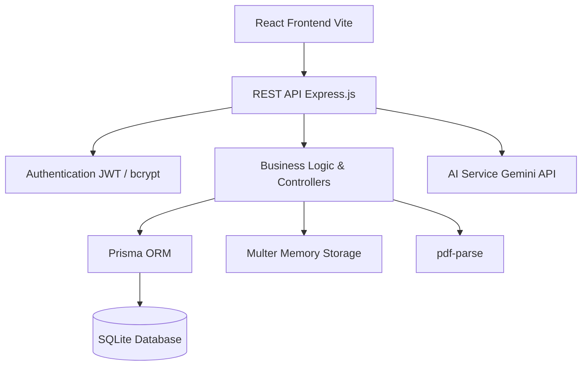
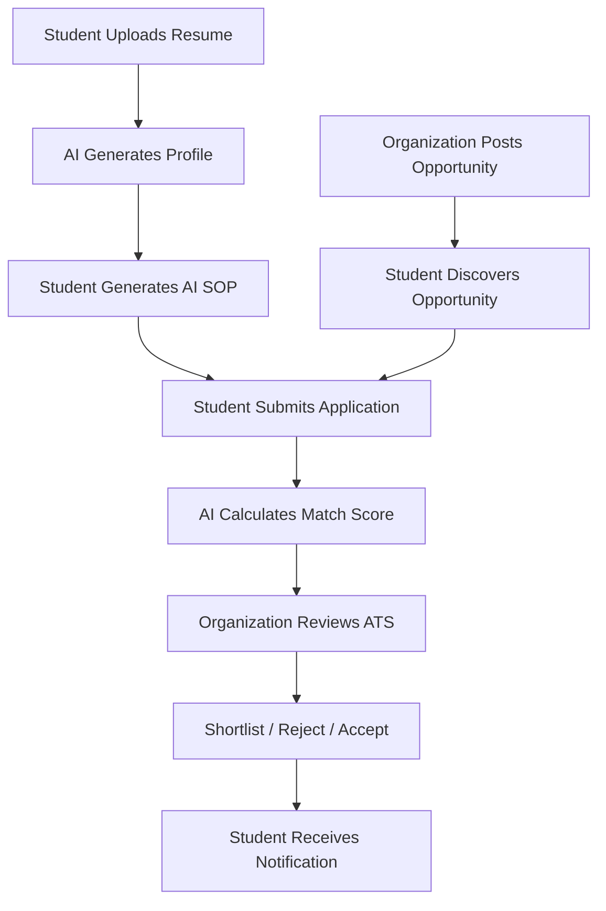

# PathFinder – AI-Powered Internship & Fellowship Platform

## 1. Project Overview
### 1.1 Introduction
Finding the right internship or fellowship is often a fragmented and overwhelming process for students. Simultaneously, organizations struggle with managing high volumes of applicants efficiently without missing top talent.
**PathFinder** is a modern, AI-powered platform designed to bridge this gap. It connects students with high-quality opportunities while providing organizations with an intelligent Applicant Tracking System (ATS). 
By deeply integrating Google Generative AI (Gemini), PathFinder automates tedious tasks such as resume parsing, profile creation, cover letter generation, and candidate evaluation, creating a seamless, centralized experience for all stakeholders.

## 2. Business Problem
Most organizations and students use disconnected systems to manage applications and hiring. Current challenges include:
- Students spend excessive time manually entering profile details across different platforms.
- Writing customized Statements of Purpose (SOPs) or cover letters for every application is time-consuming.
- Organizations manually screen hundreds of resumes without intelligent filtering.
- Applicant tracking is often handled via disjointed email threads and spreadsheets.
- Slow approval and hiring processes lead to losing top candidates.
- Lack of automated feedback and transparent application tracking for students.

These problems result in delayed decision-making, reduced productivity, and a poor experience for both applicants and recruiters.

## 3. Proposed Solution
Develop a centralized PathFinder Platform that provides:
- AI Resume Autofill (Profile Generation)
- AI SOP & Cover Letter Generator
- Centralized Opportunity Discovery (Search & Bookmarking)
- Intelligent Applicant Tracking System (ATS)
- AI Candidate Match Scoring & Summaries
- Document Management (Resumes, Transcripts)
- Analytics & Admin Dashboard
- Real-Time Notifications
- Secure Role-Based Access Control

## 4. Project Objectives
| Objective ID | Objective |
| :--- | :--- |
| OBJ-01 | Automate student profile creation using AI resume parsing |
| OBJ-02 | Digitize and streamline the internship application process |
| OBJ-03 | Reduce manual screening time for organizations using AI Match Scoring |
| OBJ-04 | Improve candidate quality through AI-assisted SOP generation |
| OBJ-05 | Provide centralized document storage for students |
| OBJ-06 | Implement a transparent Applicant Tracking System (ATS) |
| OBJ-07 | Ensure secure role-based access for Students, Orgs, and Admins |
| OBJ-08 | Build a responsive, user-friendly frontend with a modern aesthetic |

## 5. Expected Benefits
| Benefit | Description |
| :--- | :--- |
| **Reduced Manual Work** | Eliminate manual data entry for student profiles and resume screening. |
| **Improved Accuracy** | AI extraction ensures skills and experiences are accurately categorized. |
| **Faster Hiring** | ATS workflows speed up candidate progression (Reviewing -> Shortlisted -> Accepted). |
| **Better Communication** | Automated status update notifications keep applicants informed. |
| **Centralized Data** | A single source of truth for all opportunities and applications. |

## 6. Project Scope
### In Scope
The project will include the following modules:
| Module | Included |
| :--- | :--- |
| Authentication (JWT) | ✅ |
| Role Management | ✅ |
| Student Profiles | ✅ |
| Organization Profiles | ✅ |
| Opportunity Management | ✅ |
| Application & ATS | ✅ |
| Document Management | ✅ |
| AI Resume Autofill | ✅ |
| AI SOP Generator | ✅ |
| AI Candidate Scoring | ✅ |
| Notifications | ✅ |
| Admin Dashboard | ✅ |

### Out of Scope
The following features are excluded from this version:
- Native Mobile Application
- Built-in Video Conferencing / Interviewing
- Payment Gateways (for paid opportunities)
- External Job Board Integrations (LinkedIn/Indeed sync)
- Multi-language Support
- Offline Functionality

## 7. Stakeholders
| Stakeholder | Responsibility |
| :--- | :--- |
| **System Administrator** | Overall platform moderation, managing spam users and inappropriate posts. |
| **Organization HR / Recruiter** | Post opportunities, review AI match scores, and progress candidates through the ATS. |
| **Student / Applicant** | Upload documents, generate AI content, apply to opportunities, and track statuses. |

## 8. User Roles
| Role | Primary Responsibility |
| :--- | :--- |
| **Admin** | Complete control over the platform health and global moderation. |
| **Organization** | Recruitment lifecycle management for their specific company. |
| **Student** | Personal profile management and job application processing. |

## 9. Role-Based Access Control (RBAC)
| Module | Admin | Organization | Student |
| :--- | :--- | :--- | :--- |
| User Management | Full | No | No |
| Organization Profile | Read | CRUD (Own) | Read |
| Student Profile | Read | Read (Applicants only) | CRUD (Own) |
| Opportunities | CRUD (Global) | CRUD (Own) | Read / Bookmark |
| Applications (ATS) | Read | CRUD (Status) | Create / Withdraw / Track |
| AI Generators | No | Candidate Summaries | Resume Parse / SOP Gen |

## 10. High-Level System Architecture


## 11. Core Business Workflow


## 12. Key Functional Modules
| Module ID | Module Name | Description |
| :--- | :--- | :--- |
| M-01 | Authentication | User registration, login, JWT security |
| M-02 | Profile Management | Student and Org profiles, skills, portfolios |
| M-03 | Document Management | Secure resume and transcript uploads |
| M-04 | Opportunity Engine | Drafting, publishing, and archiving opportunities |
| M-05 | Application (ATS) | Applicant tracking and status management |
| M-06 | AI Assistant | Resume parsing, matching, and generation |
| M-07 | Notifications | Real-time in-app alerts |
| M-08 | Admin Moderation | Global data oversight |

## 13. AI Assistant Integration
The AI Assistant (powered by Google Gemini) is integrated contextually based on user roles:

| Feature | Description |
| :--- | :--- |
| **Resume Analyzer** | Extracts Bio, Skills, Major, and University from a PDF resume to instantly build a profile. |
| **SOP Generator** | Crafts a tailored Statement of Purpose by mapping student skills to specific opportunity requirements. |
| **Match Scoring** | Automatically evaluates an applicant's cover letter and profile against the job description, returning a 0-100% score. |
| **Candidate Summarizer** | Generates a 2-3 sentence summary of a candidate for quick recruiter screening. |

## 14. Assumptions
- Users will access the application through a modern web browser.
- External AI services (Gemini) are online and responsive.
- SQLite is sufficient for local development and initial deployment.
- Resumes uploaded are in valid, text-readable PDF format.

## 15. Constraints
| Constraint | Description |
| :--- | :--- |
| **Technology** | PERN/SERN Stack (PostgreSQL/SQLite, Express, React, Node) only. |
| **AI Rate Limits** | External AI API usage is subject to Gemini rate limits. |
| **Storage** | File uploads are currently handled in memory or local disk; requires cloud storage (e.g., AWS S3, Cloudinary) for scale. |

## 16. Success Criteria
The project will be considered successful if:
- Role-based access control successfully routes Students, Orgs, and Admins to their respective dashboards.
- AI successfully extracts accurate information from at least 90% of standard PDF resumes.
- Organizations can seamlessly progress candidates through the ATS stages.
- The UI reflects the required premium Dark Mode and Glassmorphism aesthetic.
- All core modules are integrated without breaking changes.

## 17. API Architecture & Endpoints
The platform utilizes a modular REST API built with Express.js. The endpoints are securely grouped by logical domains:

### 17.1 Core Endpoints
- **`/api/auth`**: Handles user authentication, including registration, login, and password reset functionalities. Employs JWT security and rate limiting.
- **`/api/student`**: Manages student profile creation, skill tagging, certifications, portfolio links, and document retrieval.
- **`/api/org`**: Manages organization profiles, branding (logos), and company details.
- **`/api/admin`**: Secured routes for platform moderation, audit logs, and global data management.

### 17.2 Opportunity & Application Endpoints
- **`/api/opportunities`**: CRUD operations for internships, scholarships, and grants. Supports status management (Draft/Published) and category filtering.
- **`/api/applications`**: Manages the core ATS workflow. Handles application submissions, status updates by organizations, withdrawal by students, and tracking timeline events.
- **`/api/search`**: Dedicated endpoints for complex search queries and retrieving user's bookmarked opportunities.

### 17.3 Utility & Integration Endpoints
- **`/api/ai`**: Interfaces with the Google Gemini AI service. Exposes endpoints for resume parsing, tailored SOP generation, candidate summarization, and AI match scoring.
- **`/api/notifications`**: Retrieves user-specific notifications, handles read/unread status updates, and fetches unread counts for UI badges.
- **`/api/stats`**: Exposes aggregate platform data for public display (e.g., active student count, open opportunity count).
- **`/api/upload` & `/api/files`**: Handles secure file uploads for resumes, transcripts, and organization logos using Multer, as well as role-based protected file serving.

---

# Part 2 – Functional Requirements (Core Modules)

## Module 1 – Authentication & User Management
### 1.1 Module Overview
Authentication ensures secure entry into the platform. Users register under specific roles (`STUDENT`, `ORGANIZATION`, `ADMIN`) which strictly dictate their permissions and routing.

### Business Objective
Protect user data while providing a seamless onboarding experience.

### Business Rules
- Emails must be unique across the platform.
- Passwords must be securely hashed using `bcrypt`.
- A valid JWT token is required for protected routes.
- Unknown roles default to immediate rejection.

### Acceptance Criteria
- [x] User can register securely.
- [x] Passwords are encrypted in the database.
- [x] Invalid logins return generic error messages to prevent enumeration.
- [x] JWT is issued and attached to subsequent API calls.

## Module 2 – AI Application & ATS Management
### 2.1 Module Overview
This module handles the core interaction between Students and Organizations. It manages the submission of applications and the subsequent review process.

### Features
- Submit Application with Cover Letter
- AI Match Score Calculation
- Status Updates (Pending -> Reviewing -> Shortlisted -> Accepted/Rejected)
- Undo Status Change
- Application Timeline Tracking (`ApplicationEvent`)

### Application JSON Model
```json
{
  "id": "APP_1023",
  "opportunityId": "OPP_001",
  "studentId": "STU_045",
  "status": "SHORTLISTED",
  "matchScore": 88,
  "matchReason": "Strong React skills align with requirements.",
  "coverLetter": "I am writing to express my interest...",
  "events": [
    { "type": "SUBMITTED", "date": "2026-07-01" },
    { "type": "STATUS_CHANGED", "details": "Moved to Shortlisted", "date": "2026-07-03" }
  ]
}
```

### Acceptance Criteria
- [x] Students can apply to opportunities.
- [x] AI automatically generates a match score upon submission.
- [x] Organizations can change candidate statuses.
- [x] Notifications are fired to the student on status change.
- [x] Application history is preserved via events.

## Module 3 – Platform Features
### 3.1 Notifications
PathFinder includes a robust notification system designed to keep users informed about important events.
- **Real-Time Alerts:** Students are notified immediately when their application status changes (e.g., Shortlisted, Rejected, Accepted).
- **Opportunity Alerts:** Notifications for approaching deadlines or when an application is withdrawn.
- **System Notifications:** Admin announcements and platform-wide alerts are supported.
- **Unread Tracking:** Users can see unread notification counts and mark notifications as read directly from the notification center.

### 3.2 Advanced Search & Bookmarks
- **Semantic Search:** Users can search for opportunities using keywords, categories (Internship, Scholarship, Hackathon), or locations.
- **Bookmarking:** Students can save opportunities to a "Bookmarks" list to apply later.
- **Saved Searches:** Users can save specific search criteria to easily find new matches in the future.

### 3.3 Analytics & Statistics
- **Public Stats:** The dynamic landing page displays real-time platform statistics such as the total number of active students, open opportunities, and top organizations.
- **Dashboard Metrics:** Students and organizations have access to quick metrics on their respective dashboards (e.g., total applications submitted, total candidates reviewed).

